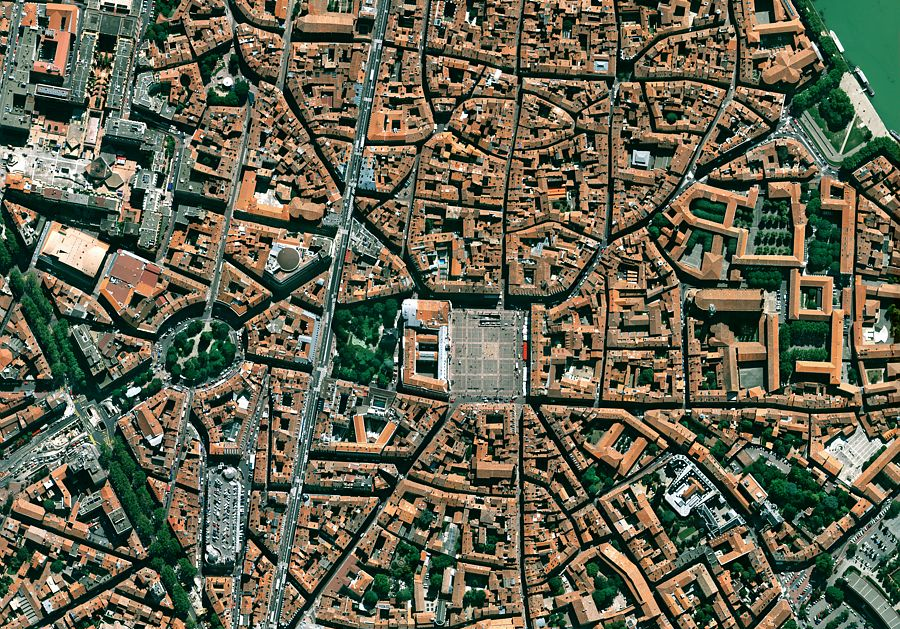
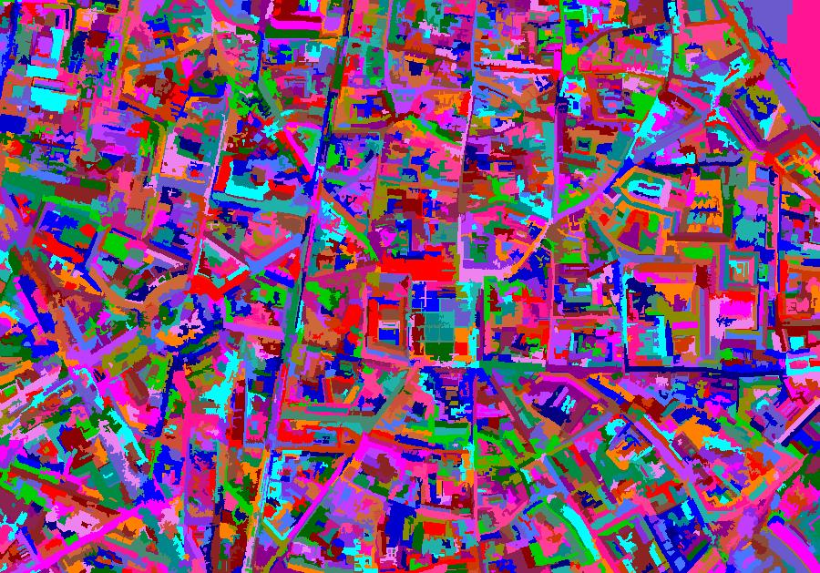
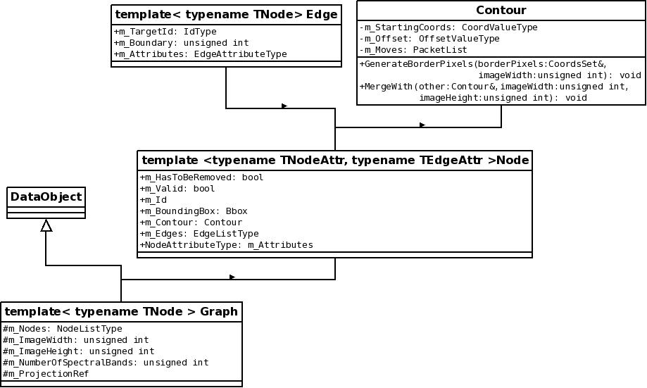
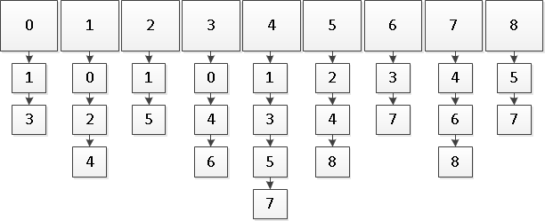

LSOBIA
======

__Large Scale Object Based Image Analysis__ (LSOBIA) is a module for
the [Orfeo Toolbox](https://www.orfeo-toolbox.org/) (OTB). It provides
several tools for object based, large scale, remote sensing image
analysis.

The module contains 5 OTBApplications:

* __LSSegmentation__ (Large Scale Segmentation) provides several
  methods to perform segmentation of very high resolution images.
* __LSSmallRegionsMerging__ (Large Scale Image Small Regions Merging)
  provides a method to perform small regions merging of very high
  resolution images.
* __Polygonize__ provides several methods to perform polygonization of
  high resolution images.
* __LSPolygonize__ (Large Scale Polygonize) is a distributed version
  of Polygonize. (_work in progress_)
* __ComputeAttributes__ computes several attributes of a vector file.

# Table of contents
1. [Getting started](#getting-started)
2. [Some results](#some-results)
3. [Under the hood](#under-hood)
4. [License](#license)

<a name="getting-started"></a>
# Getting started

## Dependencies

* [OTB](https://www.orfeo-toolbox.org/)
* The C++ library for the [Message Passing
  Interface](https://www.mpi-forum.org/) (MPI) (developed and
  validated with mpich-3.2)

Since LSOBIA is a module for the OTB, one need to install the OTB in
order to build it.

LSOBIA allows the distribution of the calculation on a computation
cluster, therefor it uses MPI for the communications between the
clusters.

## Building
LSOBIA can be built like any other [otb remote
module](https://wiki.orfeo-toolbox.org/index.php/How_to_write_a_remote_module).
You can build it either from within OTB's sources or outside it.

Don't forget to activate C++14 by setting the cmake parameter
_"CMAKE\_CXX\_FLAGS"_ to _"-std=c++14"_.

## Usage

LSOBIA can run on a single processor, or be distributed over multiple processors.

### Mono-processor execution

To run an application on a single processor, one needs to call the
application using the OTB application launcher process:

```bash
otbApplicationLauncherCommandLine ${AppName} ${AppDirectory} ${Parameters}
```

* ${AppName} is the name of the application (ie: LSSegmentation or
  Polygonize).
* ${AppDirectory} is the path to the directory containing the compiled
  applications.
* ${Parameters} are the parameters for the application.

Example:

```bash
otbApplicationLauncherCommandLine LSSegmentation /home/me/bin/lsobia/lib/otb/applications -io.im inputimage.tif -io.out.dir /home/me/out -io.temp /tmp -algorithm baatz -algorithm.baatz.maxiter 45 -processing.memory 10000 -processing.nbproc 8 -processing.nbtilesperproc 2 -processing.writeimages on -processing.writegraphs off
```

### Multi-processor execution

Simply add "*mpirun -np ${NumberProcessor}*" before the previous
command. ${NumberProcessor} is the number of processors to be used for
the computation.

Example:

```bash
mpirun -np 8 otbApplicationLauncherCommandLine LSSegmentation /home/me/bin/lsobia/lib/otb/applications -io.im inputimage.tif -io.out.dir /home/me/out -io.temp /tmp -algorithm baatz -algorithm.baatz.maxiter 45 -processing.memory 10000 -processing.nbproc 8 -processing.nbtilesperproc 2 -processing.writeimages on -processing.writegraphs off
```

<a name="some-results"></a>
# Some results

## Baatz segmentation

We applied the LSSegmentation application with the Baatz algorith on
this image, and obtained the following label image as output. The
process used a single processor for the computation.

```bash
otbApplicationLauncherCommandLine LSSegmentation /home/me/bin/lsobia/lib/otb/applications "-io.im" "${INPUT_IMAGE}" "-io.out.dir" "${OUTPUT_DIRECTORY}" -io.out.labelimage "LabelImage" "-io.temp" "${TEMP}" "-algorithm" "baatz" "-algorithm.baatz.numitfirstpartial" "5" "-algorithm.baatz.numitpartial" "5" "-algorithm.baatz.stopping" "40" "-algorithm.baatz.spectralweight" "0.5" "-algorithm.baatz.geomweight" "0.5" "-algorithm.baatz.aggregategraphs" "on" "-processing.writeimages" "on" "-processing.writegraphs" "on" "-processing.memory" "2000" "-processing.maxtilesizex" "1000" "-processing.maxtilesizey" "1000"
```

Input image:



Result:



<a name="under-hood"></a>
# Under the hood

## Base data structures



### Adjacency graph

Adjacency graph are often used when dealing with OBIA
segmentation. They are a way to represent the objects on the image,
and their proximity. Each node of the graph represents an object
(eather spectral or geometric), and each edge of the graph represent
the fact that two nodes are neighbors.

In LSOBIA, we use a list to represent a graph. The list contains the
nodes. Each node contains an other list: the edges to the adjacent
nodes. As a reminder, two nodes are spatially adjacent if they share a
common border in the image.

For instance, let's consider a 3x3pixels image, each pixel being a
node of the graph. Let's call *0* the pixel in the corner top left,
and *8* the pixel in the corner bottom right. The corresponding
agjacency graph would be as follow:



### Contour

The position of the objects in the image is important. Therefor, each
node also contains a contour representing the object encoded as a
[freeman
chain](http://www.mif.vu.lt/atpazinimas/dip/FIP/fip-Contour.html). It
is optimized to reduce memory consumption. Indeed, instead of storing
pixels coordinates, we store elementary moves. Each move takes 2 bits
to encode.

## Segmentation algorithms

### Iterative segment fusion

Iteratively fuse adjacent segment pairs which are similar according to
spectral and spatial homogeneity criterions.

#### The algorithm

Graph initialization: each pixel of the image is a node of the graph,
edges are added to connected pixels.

For each iteration:

* Computation of the cost function for each pair of node.
* Go through the graph and select pairs of connected nodes (N1, N2)
  where N1 is best neighbour for N2 and conversely (Local Mutual Best
  Fitting).
* Fuse the nodes (update attributes, fuse contours and bounding boxes,
  remove extra edges) if cost(N1, N2) < Threshold.
  
#### Stability margin

The algorithm requires a stability margin to function. Indeed, to find
the best neighbour, the algorithm need to know all the neighbours,
even those processed by other processors. The size of the stability
margin depends on the number of iteration, following this law : Mn =
2^(n+1)-2. This means that for 15 iterations, the size of the margin
needs to be 65534 pixels. To avoid such an explotion of the stability
margin, the algorithm works by batches of fusions : 

* Work on a small number of iterations of fusion
* If convergence is reached, stop
* Else, communicate with other processors to share the new margins
* Iterate

#### Parameters

* **io.im** path to the input image
* **io.out.dir** path to the output directory
* **io.out.labelimage** _optional_ name of the output label image
* **io.temp** path to the temporary directory
* **algorithm.baatz.numitfirstpartial** _optional_ number of iterations for first fusion batch _default 1_
* **algorithm.baatz.numitpartial** _optional_ number of iterations for fusion batch _default 1_
* **algorithm.baatz.maxiter** _optional_ max number of iterations _default 75_
* **algorithm.baatz.mindec** _optional_ minimum decreasing of accumulated memory _default 0.0_
* **algorithm.baatz.scale** _optional_ value for scale criterion _default 60.0_
* **algorithm.baatz.spectralweight** _optional_ value for spectral weight _default 0.05_
* **algorithm.baatz.geomweight** _optional_ value for geometric (shape) weight _default 0.95_
* **processing.memory** maximum memory to be used on the main node (Mo)
* **processing.nbproc** _optional_ number of processor allocated to the processing
* **processing.nbtilesperproc** _optional_ number tiles processed on each processor
* **processing.maxtilesizex** _optional_ maximum size of tiles along x axis
* **processing.maxtilesizey** _optional_ maximum size of tiles along y axis
* **processing.writeimages** _optional_ activation of image traces
* **processing.writegraphs** _optional_ activation of graph traces
* **algorithm.baatz.aggregategraphs** _optional_ aggregation of graph traces
* **processing.nodatavalue** _optional_ definition of no data value _default 0.0_

### MeanShift

Chaining of a MeanShift filter and a connected components segmentation

#### The algorithm
Two step segmentation: 

* **MeanShift** Create classes of pixels by selecting local maximums (modes) in the
probability density of the image and associating each pixel to the
closest mode.
* **Connected components segmentation** Agregating connected pixels
  with same mode

#### Parameters

* **io.im** path to the input image
* **io.out.dir** path to the output directory
* **io.out.labelimage** _optional_ name of the output label image
* **io.temp** path to the temporary directory
* **algorithm.meanshift.maxiter** max number of iterations
* **algorithm.meanshift.spatialr** _optional_ spatial bandwidth
* **algorithm.meanshift.spectralr** _optional_ spectral bandwidth
* **algorithm.meanshift.threshold** _optional_ threshold
* **algorithm.meanshift.ranger** _optional_ spectral range ramp
* **algorithm.meanshift.modesearch** _optional_ activation of search mode
* **processing.memory** maximum memory to be used on the main node (Mo)
* **processing.nbproc** _optional_ number of processor allocated to the processing
* **processing.nbtilesperproc** _optional_ number tiles processed on each processor
* **processing.maxtilesizex** _optional_ maximum size of tiles along x axis
* **processing.maxtilesizey** _optional_ maximum size of tiles along y axis
* **processing.writeimages** _optional_ activation of image traces
* **processing.writegraphs** _optional_ activation of graph traces
* **processing.nodatavalue** _optional_ definition of no data value _default 0.0_

<a name="license"></a>
# License
This project is licensed under the Apache License 2.0. Please see the
[LICENSE file](LICENSE) for legal issues on the use of the software.
